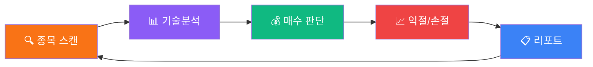

<div align="center">

# 🚀 forAnt

### _개미들을 위한 AI 자율 트레이딩 플랫폼_

<br/>


<br/>


<br/><br/>

> **"매일 차트 볼 시간 없잖아요. AI한테 맡기세요."**

<br/>

</div>

---

## ✨ 한눈에 보기

```
🏠 대시보드        →  환율 · 시세 · 랭킹 · AI 추천 · 잔고 · 보유종목
💹 매매            →  시장가 · 지정가 · 장전시간외 · 시간외종가 · 시간외단일가
🤖 자율 스캘핑     →  종목탐색 → 매수 → 익절/손절 → 전부 AI가 알아서
📊 리포트          →  일일/주간 손익 자동 리포트 · 전략별 승률 추적
⚙️ 설정            →  실전/모의 듀얼 모드 · API 연결 상태 · 비밀번호 보호
```

---

## 🧠 AI 분석 엔진 — 뭐가 들어있나요?

<table>
<tr>
<td width="50%">

### 📈 기본 지표
| 지표 | 역할 |
|------|------|
| RSI (14) | 과매수/과매도 감지 |
| MACD | 추세 전환 시그널 |
| 볼린저밴드 | 변동성 + 밴드워크 |
| SMA / EMA | 이동평균 골든/데드크로스 |
| ATR | 변동성 기반 익절/손절 |
| OBV | 거래량 추세 확인 |

</td>
<td width="50%">

### 🔬 고급 지표
| 지표 | 역할 |
|------|------|
| Williams %R | RSI보다 빠른 과매수/과매도 |
| Keltner Channel | ATR 기반 채널 돌파 |
| Volatility Squeeze | BB↔KC 수렴 → 폭발 직전 감지 |
| Volume Profile | 가격대별 거래량 (POC/VAH/VAL) |
| 패턴 인식 | 쌍바닥 · 불플래그 · 역헤숄 |
| 멀티 타임프레임 | 1분·5분·일봉 방향 정렬 |

</td>
</tr>
</table>

<br/>

<div align="center">

### 🏦 수급 분석

**외국인 순매수** · **기관 순매수** · **개인 순매수** — KIS 투자자별 매매동향 API로 실시간 반영

</div>

---

## 🤖 자율 스캘핑 — 이게 핵심이에요

<div align="center">



</div>

### 🎯 리스크 관리가 진짜 중요하죠

| 기능 | 설명 |
|------|------|
| 🛡️ **트레일링 스탑** | 고점 대비 ATR×2 하락 시 자동 매도 — 수익은 지키고 |
| ✂️ **분할 익절** | 익절가 60% 도달 → 50% 먼저 매도, 나머지 트레일링 |
| 📐 **ATR 포지션 사이징** | 변동성 큰 종목은 적게, 안정적 종목은 많이 |
| 🏭 **섹터 한도** | 동일 섹터 최대 2종목 — 몰빵 방지 |
| ⏰ **시간대 전략** | 장 초반·점심·마감 각각 다른 전략 적용 |
| 🧪 **적응형 학습** | 매매 사유별 승률 추적 → 점수 자동 보정 |
| 📉 **일일 손실 한도** | 설정 금액 초과 시 자동 중단 |

### 🌙 에프터마켓도 OK

| 구분 | 시간 | 방식 |
|------|------|------|
| 장전시간외 | 08:20~08:40 | KRX |
| 정규장 | 09:00~15:30 | KRX |
| 시간외종가 | 15:40~16:00 | KRX |
| 시간외단일가 | 16:00~18:00 | KRX |
| **NXT 대체거래소** | **08:00~20:00** | **KRX 불가 시 자동 전환** |

> NXT(넥스트레이드)에서 주문할 때는 **실시간 현재가를 조회**해서 가격 에러를 방지해요

---

## 📊 자동 리포트

```
📁 .trading-reports/
├── 2026-03-18.json     ← 오늘의 리포트 (장 종료 후 자동 생성)
├── 2026-03-17.json
├── 2026-03-16.json
└── ...
```

| API | 설명 |
|-----|------|
| `GET /api/trading-report?type=daily` | 오늘 일일 리포트 |
| `GET /api/trading-report?type=weekly` | 최근 7일 합산 |
| `GET /api/trading-report?type=reasons` | 전략(reason)별 승률 통계 |

---

## 🖥️ UI 미리보기

<div align="center">

| 대시보드 | 자율 스캘핑 |
|:---:|:---:|
| 환율 · 랭킹 · AI추천 · 잔고 | 스캔 · 보유종목 · 매매로그 |
| `Dark Glassmorphism` | `Ambient Glow` |

</div>

### 🎨 디자인 키워드

```
Dark Mode Only · Glassmorphism · Ambient Gradient Glow
Mono Font Numbers · Emerald(+) / Rose(-) Color System
```

---

## ⚡ 빠른 시작

### 1️⃣ 설치

```bash
git clone https://github.com/JH-100/fotAnt.git
cd fotAnt
npm install
```

### 2️⃣ 환경변수

`.env.local` 파일 생성:

```env
# ========== 실전투자 ==========
KIS_REAL_APP_KEY=발급받은_앱키
KIS_REAL_APP_SECRET=발급받은_시크릿
KIS_REAL_ACCOUNT_NO=계좌번호-상품코드   # 예: 64605609-01

# ========== 모의투자 ==========
KIS_MOCK_APP_KEY=발급받은_모의_앱키
KIS_MOCK_APP_SECRET=발급받은_모의_시크릿
KIS_MOCK_ACCOUNT_NO=모의계좌번호-상품코드  # 예: 50177280-01

# ========== 실전투자 주문 비밀번호 ==========
TRADING_PASSWORD=원하는비밀번호
```

> 🔑 KIS API 키는 [한국투자증권 API 포털](https://apiportal.koreainvestment.com)에서 발급

### 3️⃣ 실행

```bash
npm run dev
```

👉 [http://localhost:3000](http://localhost:3000) 접속

> 같은 네트워크의 다른 기기에서도 `http://서버IP:3000`으로 접속 가능!

---

## 🗂️ 프로젝트 구조

```
src/
├── app/
│   ├── (dashboard)/              # 📄 페이지 (대시보드, 자동매매, 설정)
│   └── api/
│       ├── exchange-rate/        # 💱 환율
│       ├── stocks/               # 📈 주식 시세
│       ├── ranking/              # 🏆 랭킹
│       ├── kis/                  # 🏦 KIS (잔고, 주문, 내역)
│       ├── recommendations/      # 🧠 AI 추천
│       ├── auto-trade/           # 🤖 자율 스캘핑
│       └── trading-report/       # 📊 일일/주간 리포트
├── components/
│   ├── dashboard/                # 대시보드 UI
│   ├── trading/                  # 매매 UI
│   ├── auto-trade/               # 스캘핑 UI (제어·설정·보유종목·스캔·로그)
│   ├── layout/                   # 네비게이션
│   └── ui/                       # shadcn/ui
├── lib/
│   ├── kis-api.ts                # KIS API (듀얼 모드 · 토큰 · 현재가 · 수급)
│   ├── scalping-engine.ts        # 스캘핑 엔진 (트레일링·분할익절·학습·리포트)
│   ├── server-scheduler.ts       # 서버 스케줄러 (3분 간격 · 보유종목 캐시)
│   ├── stock-scanner.ts          # 종목 스캐너 (15+ 지표 종합 분석)
│   ├── indicators.ts             # 기술 지표 (기본 6종 + 고급 6종)
│   ├── frankfurter.ts            # 환율 API
│   ├── recommendation-engine.ts  # 추천 엔진
│   └── strategies/               # 매매 전략 타입
├── hooks/                        # TanStack Query 훅
├── store/                        # Zustand 스토어
├── types/                        # TypeScript 타입
└── constants/                    # 상수
```

---

## 🛡️ 보안

| 항목 | 설명 |
|------|------|
| 🔐 실전 주문 | `TRADING_PASSWORD`로 비밀번호 보호 |
| 🧪 모의투자 | 비밀번호 없이 자유롭게 |
| 🔒 API 키 | 서버사이드 전용, 브라우저 미노출 |
| 🎫 토큰 관리 | 모드별 분리 캐시, 중복 발급 방지 |

---

## 🔧 기술 스택

<div align="center">

| Layer | Stack |
|-------|-------|
| **Framework** | Next.js 16 (App Router + Turbopack) |
| **Language** | TypeScript (strict mode) |
| **Styling** | Tailwind CSS v4 · Dark Glassmorphism |
| **State** | Zustand v5 (client) · TanStack Query v5 (server) |
| **UI** | shadcn/ui · Radix Primitives |
| **API** | 한국투자증권 KIS OpenAPI · Frankfurter ECB |
| **Trading** | NXT 넥스트레이드 대체거래소 지원 |

</div>

---

## 📌 데이터 소스

| 데이터 | 소스 | API 키 |
|--------|------|--------|
| 💱 환율 | Frankfurter (ECB) | ❌ 불필요 |
| 📈 주식 시세 · 거래량 · 분봉 · 일봉 | KIS OpenAPI | ✅ 필요 |
| 🏦 잔고 · 주문 · 체결내역 | KIS OpenAPI | ✅ 필요 |
| 👥 투자자별 매매동향 (수급) | KIS OpenAPI | ✅ 필요 |

---

## ⚠️ 주의사항

```diff
+ 모의투자를 충분히 테스트한 후 실전투자로 전환하세요
+ 서버사이드 스케줄러는 브라우저 닫아도 계속 실행됩니다
- 투자에 대한 최종 판단과 책임은 사용자 본인에게 있습니다
! 서버 재시작 시 스케줄러 상태가 초기화됩니다 (로그는 파일로 보존)
```

---

<div align="center">

### 🐜 forAnt

**개미는 작지만, 함께하면 강하다.**

_Built with ❤️ and AI_

<br/>


</div>
